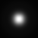
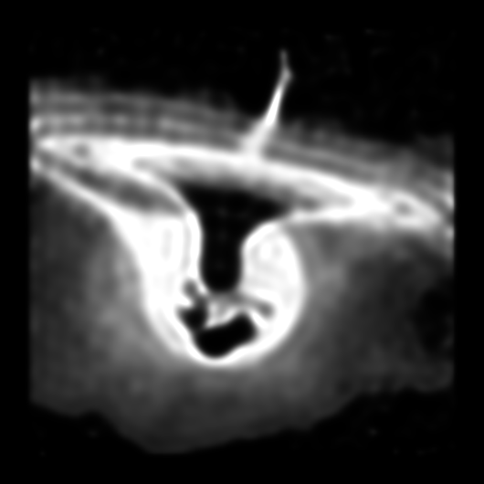

# Deconvolution method

- [x] Richardson-Lucy Method
- [x] Visual Studio Debug
- [ ] Multithread
- [ ] CUDA
- [ ] Auto PSF core
- [ ] Visualization

| original image  | convolved image | deconvolved image |
|:---:|:---:|:---:|
||||